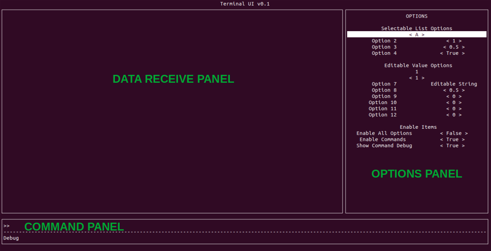

# TerminalUI

A Python Package that allows for the easily development of Terminal User Interfaces that require asynchronous read/write. Features include:

- TerminalUI class which handles user keypresses, simply pass it your command entered function
- Asynchronous read/write capabilities
- Configurable options panel for configuring your application at runtime
- Options can either be a list of selectable values or an editable value
- Several other features

The package is built upon [urwid](http://urwid.org/). This means, unfortunately, based on how the TerminalUI class is currently implemented it will not work with on Windows. It will however, work with the Windows Linux Subsystem (WSL). Here is a [guide](https://docs.microsoft.com/en-us/windows/wsl/install-win10) on how to enable WSL on Windows 10. 

## Installation

To install via pip
    
    pip3 install terminalui

To install from source (with symlink so updates to source are immediately reflected in packages that utilise TerminalUI)

    git clone https://github.com/jmount1992/TerminalUI.git
    python3 -m pip install --user --upgrade setuptools wheel
    python3 setup.py sdist bdist_wheel 
    pip3 install -e . 

## Documentation

Additional documentation will be coming in the future. For now check out the examples and the docstrings in the TerminalUI class.